# Learn kubernetes by doing

Learning by doing is the simple idea that we are capable of learning more about something when we perform the action.

So this guide aims to help you start in the Kubernetes world by doing hands-on exercises.

There is a minimal needed theory that you have to learn before starting the exercises.

I'll provide you with this minimum needed theory, but also on each exercise I'll put helpers links in case you want to deepen your knowledge or better understand how things work.

All the charts of this tutorial (except the chart from section 3.1) were created using draw.io

> This guide was created during the onboarding process at [Muttdata.ai](https://muttdata.ai/), an Argentinian startup focused on building modern data solutions with Cloud Computing, Machine Learning, Software engineering, and more.
>
>Thanks for always promoting self-learning and [knowledge sharing](https://muttdata.ai/blog/).


<p align="center">
   <a href=https://muttdata.ai>
    </img>
  </a>
  <a href=https://ar.linkedin.com/company/mutt-data>
    </img>
  </a>
  <a href=https://www.youtube.com/channel/UCzQyAiNmw4os0sTB0v5D4WA>
    </img>
  </a>
  <a href=https://www.instagram.com/mutt.data>
    </img>
  </a>
</p>
  


## [Table of contents](#table-of-contents)

- [Icons reference](#icons-reference)
- [Minimum needed knowledge](#minimum-needed-knowledge)
  - [1 - What is K8s](#1---what-is-k8s)
  - [2 - What problems does kubernetes solve?](#2---what-problems-does-kubernetes-solve)
  - [3 - K8s Architecture and objects](#3---k8s-architecture-and-objects)
      - [3.1 - Cluster](#31---cluster)
      - [3.2 - Worker nodes](#32---worker-nodes)
          - [3.2.1 - Pods](#321---pods)
          - [3.2.2 - Pods networking](#322---pods-networking)
          - [3.2.3 - kubelet](#323---kubelet)
          - [3.2.4 - Container runtime](#324---container-runtime)
          - [3.2.5 - kube-proxy](#325---kube-proxy)
      - [3.3 - k8s objects](#33---k8s-objects)
          - [3.3.1 - Services](#331---services)
          - [3.3.2 - Types of services](#332---types-of-services)
          - [3.3.3 - Ingress](#333---ingress)
          - [3.3.4 - ReplicaSet](#334---replicasets)
          - [3.3.5 - Deployments](#335---deployments)
          - [3.3.6 - Namespace](#336---namespaces)
          - [3.3.7 - ConfigMap and secrets](#337---configmap-and-secret)
      - [3.4 - Master Nodes (control plane)](#34---master-nodes-control-plane)
          - [3.4.1 - kube-apiserver](#341---kube-apiserver)
          - [3.4.2 - kube-scheduler](#342---kube-scheduler)
          - [3.4.3 - kube-controller-manager](#343---kube-controller-manager)
          - [3.4.4 - etcd](#344---etcd)
          - [3.4.5 - cloud-controller-manager](#345---cloud-controller-manager)
  - [4 - volumes](#4---volumes)   
  - [5 - Kubectl — The CLI](#5---kubectl---the-cli)  
  - [6 - Creating objects: manifest files vs imperative declaration](#6---creating-objects-manifest-files-vs-imperative-declaration)

- [Hands-on exercises](#hands-on-exercises)
- [Credits and Acknowledgements](#credits-and-acknowledgements)

# Icons reference
**[Return to topics list](#table-of-contents)**

These [icons](https://github.com/kubernetes/community/tree/master/icons) are a way to standardize Kubernetes architecture diagrams for presentation. Having uniform architecture diagrams improve understandability.

You'll understand the meaning of these icons as you progress through this guide.

You can come back here whenever you need an icon reference.

<p align="center">
  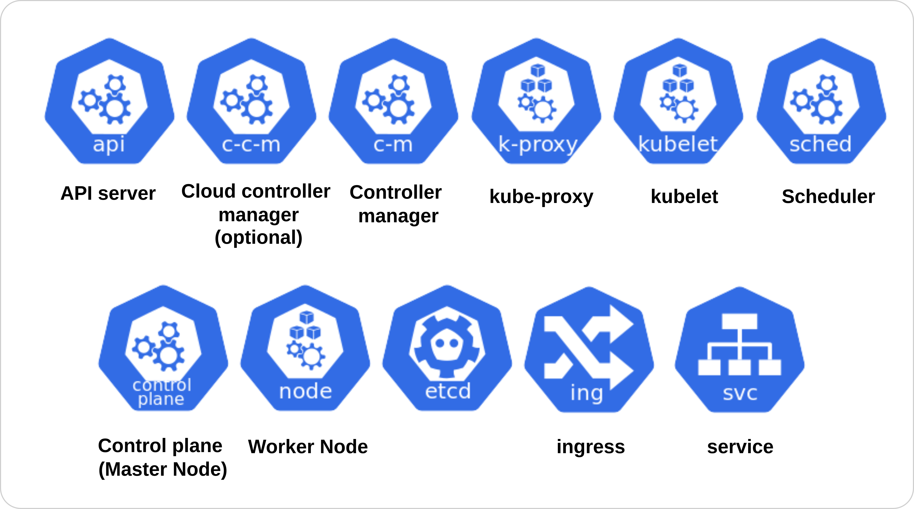
</p>

# Minimum needed knowledge

## 1 - What is k8s?
**[Return to topics list](#table-of-contents)**

- Kubernetes (aka k8s) is an open-source container orchestration framework. 
- It was originally developed by google
- It helps you manage containerized applications (be docker containers or some other technology)
- These applications can be made up of hundreds or maybe thousands of containers in different environments (physical machines, VMs, cloud, etc) 

## 2 - What problems does kubernetes solve?
**[Return to topics list](#table-of-contents)**

Kubernetes becomes very useful when you're working with microservices.

Just to remember, a microservices architecture is an architecture that breaks an application into various small independent services that communicate with each other over well-defined APIs, unlike traditional monolithic architecture, where all processes are tightly coupled and run as a single service.

<p align="center">
  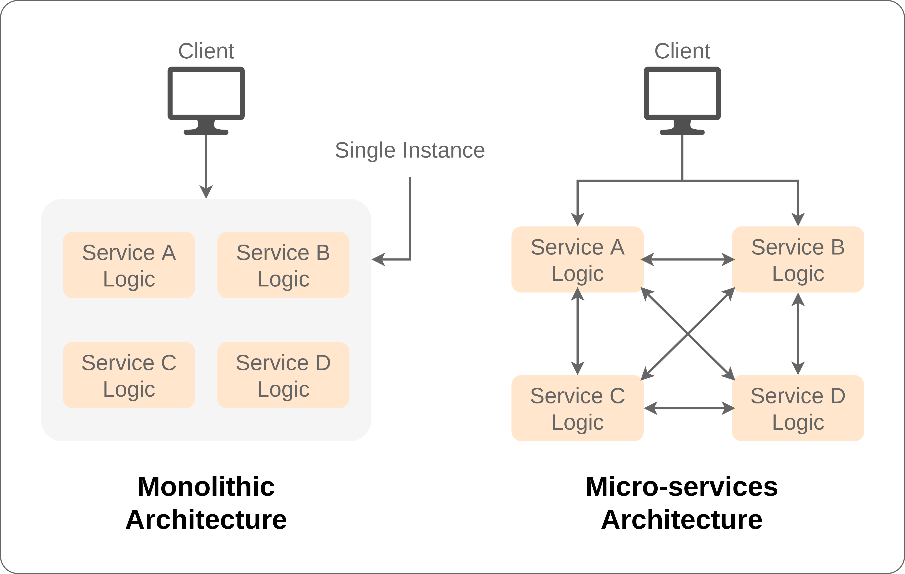
</p>

The rise of microservices caused increased usage of container technologies. These microservices are sometimes made up of hundreds or maybe even thousands of containers. 

Now managing those loads of containers across multiple environments using scripts and self-made tools can be really complex and sometimes even impossible.

So that specific scenario actually caused the need for having container orchestration technologies like Kubernetes.

Some of the problems that k8s solves are:

- **Microservices communication**: if you have an application made up of hundreds of Microservices, they need to efficiently and reliably communicate with each other. Kubernetes can take care of that (later you will understand how k8s do this).

- **high availability or no downtime**: high availability means that the application has no downtime so it's always accessible by the users. 

- **Horizontal scaling**: The workload on your application could increase and decrease abruptly in different moments. Sometimes you have to scaling up the replicas of a service to balance the workload, and after the overload you have scaling it down to keeps your costs low. Kubernetes can do that for you (auto scale).

- **Self healing**: Whenever one of the hundreds of services goes down due to fatal error, you’ll want to automatically instantiate a new, healthy replica of this service. Kubernetes can do this for you (self healing).

- **Automated rollouts and rollbacks**: Kubernetes can take care of deployment operations like the rollout of a new version of the application, and the rollback to a previous version. All of these operations can be performed reliably just by executing a couple of commands from a command line.

- **Secret and configuration management**: Kubernetes provides built-in mechanisms to effectively store and manage configuration (like environmental variables, database connections) across different environments (eg : production, test, development). It also allows for storing sensitive configuration data, meant to be kept secret in a special manner, so that accidental exposure of such data is minimized.


## 3 - K8s Architecture and objects

### 3.1 - Cluster
**[Return to topics list](#table-of-contents)**

**[Check icons reference](#icons-reference)**

A Kubernetes cluster consists of a set of worker machines (virtual or physical machines), called nodes, that run containerized applications.

Remember that containerized applications are applications that run in isolated runtime environments called containers. 

Containers encapsulate an application with all its dependencies, including system libraries, binaries, and configuration files (like Docker containers).

These are the components of a Kubernetes cluster:

<p align="center">
  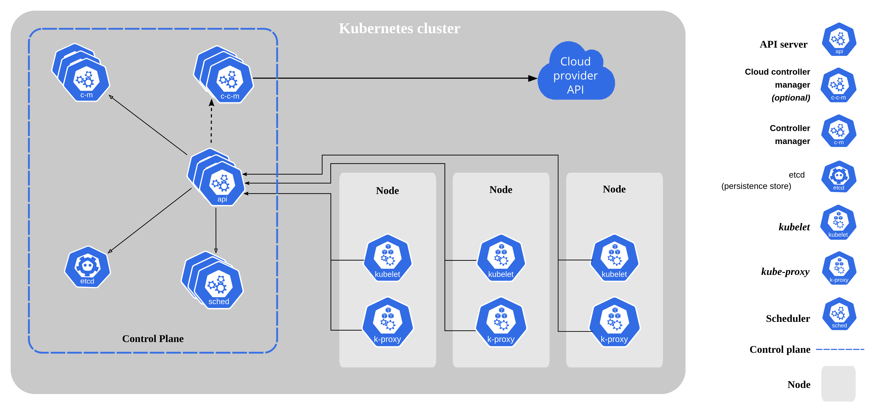
</p>

### 3.2 - Worker nodes
**[Return to topics list](#table-of-contents)**

**[Check icons reference](#icons-reference)**

- A node may be a virtual or physical machine, depending on the cluster.
- Every cluster has at least one worker node.
- Kubernetes runs your workload into the Worker Nodes. 
- These workloads are containerized applications.
- On each node, you'll find a set of pods (where containerized applications run) as well as 3 important daemons processes: kubelet, kube-proxy, and the container runtime.
- Let's see what these components are.

<p align="center">
  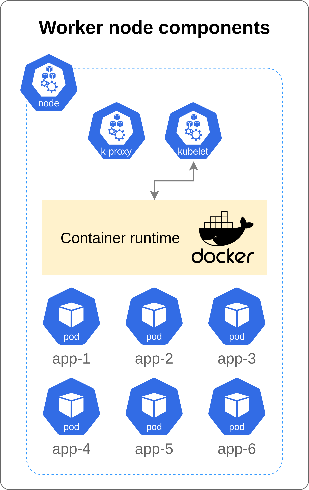
</p>

### 3.2.1 - Pods
**[Return to topics list](#table-of-contents)**

- The worker nodes host the pods. 
- Pods are the smallest deployable units of computing that you can create and manage in Kubernetes.
- A Pod contains one or more containers (not necessarily Docker containers), with shared storage and network resources.
- A Pod is usually meant to run one application container inside of it (but you can run multiple containers inside one pod). 
- For example, in a worker node you could have one pod that runs a database app, and another pod that runs some python app.
- Pods are ephemeral which means that they are not designed to run forever, so they can die very easily.
- It's recommended to have **no more than 110 pods per node** (check out the [considerations for large clusters](https://kubernetes.io/docs/setup/best-practices/cluster-large/)).

### 3.2.2 - Pods networking

**[Return to topics list](#table-of-contents)**

**[Check icons reference](#icons-reference)**

- When pods are created, they are assigned a unique IP address (**, not the container** the pod gets the IP address).
- Containers inside a pod share the same network space, which means that, within the pod, containers can communicate with each other by using the localhost address.
- Also, each container inside a pod gets its own port.
- You can use this IP (and the corresponding port) to access the pod from anywhere within the Kubernetes cluster.
- So each pod can communicate with each other using that IP address, which is an internal IP address.

<p align="center">
  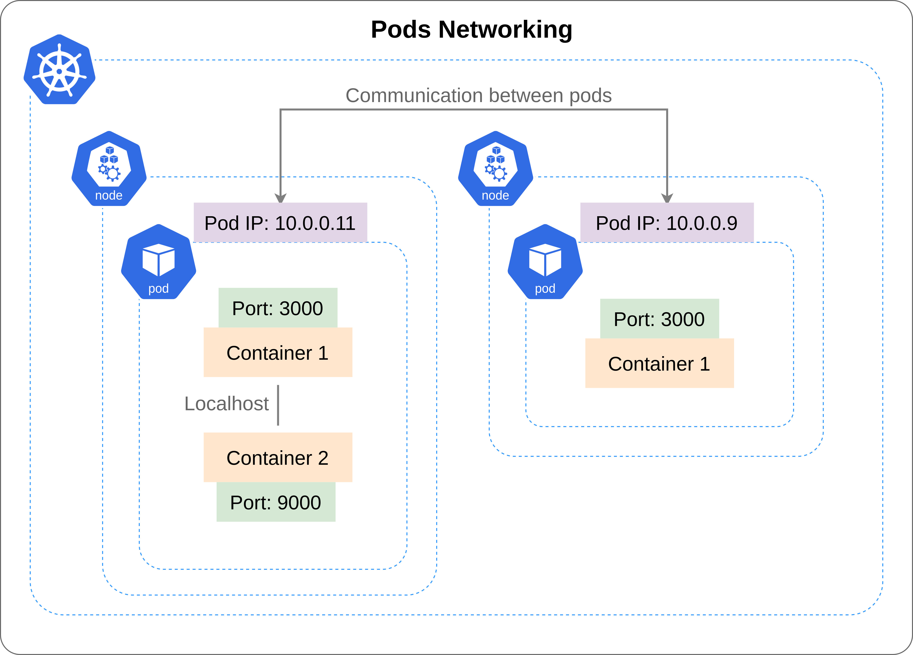
</p>

### 3.2.3 - kubelet

**[Return to topics list](#table-of-contents)**

- The way k8s schedule and manage the pods is by using three processes that must be installed on every node.
- One of those processes is kubelet.
- The Kubelet is the Kubernetes agent whose responsibility is to interact with the container runtime to perform operations such as starting, stopping, maintaining containers, and assigning resources from the node to the container like CPU, ram, and storage resources.  

### 3.2.4 - Container runtime

**[Return to topics list](#table-of-contents)**

- The container runtime is responsible for managing the life cycle of each container running in the node. 
- After a pod is scheduled on the node, the container runtime pulls the images specified by the pod from the container registry (e.g Docker regitry, Google Cloud container registry, etc).
- When a pod is terminated, the container runtime kills the containers that belong to the pod.


### 3.2.5 - kube-proxy
**[Return to topics list](#table-of-contents)**

- Let’s say we have several pods with replicas running in our cluster.
- When a request reaches the k8s cluster, how is it forwarded to one of the underlying pods? By using the kube-proxy.
- The kube-proxy component is implemented as a network proxy and a load balancer. 
- It orchestrates the network to route requests to the appropriate pods. 
- kube-proxy **can only route traffic within a Kubernetes cluster**
- It routes traffic to the appropriate pod based on the associated service name and the port number of an incoming request (you'll learn more about services in the next section).

## 3.3 - k8s objects
**[Return to topics list](#table-of-contents)**

Kubernetes Objects are persistent entities in the Kubernetes system. Kubernetes uses these entities to represent the state of your cluster. 

There are many kinds of objects: **pods, Deployments, services, ReplicaSets, etc**.

In k8s objects can be created from a YAML file using the command line, or even you can avoid this YAML file and use the command line by passing some flags with values.

You'll learn more about this in the section :  

**Creating objects: manifest files vs imperative declaration**

### 3.3.1 - Services

**[Return to topics list](#table-of-contents)**

**[Check icons reference](#icons-reference)**

- Pods are constantly created and destroyed. This could happen for many reasons. For example when a pod crashes, when bugs are fixed or new features are added to an application, etc. 
- In any case, the pod will die and a new one will get created in its place. When this happens **it will get assigned a new IP address**. 
- Obviously, this is inconvenient because if you are communicating with that pod, you have to adjust the IP address every time the pod dies or restarts.
- **You need a way to reach the pods regardless of their IP address**. To solve this, Kubernetes introduces the concept of ```service```.
- A service is an abstraction layer, that **acts as a static IP address** that defines access to a set of pods. 
- By using a service, you don’t access pods directly through their private IP addresses. 
- Instead, **a service select all the Pods matching certain criteria** (for example, a label), and the **Kube-proxy** forwards the requests to those pods.
- The good thing here is that **the life cycles of the service and the pod are not connected** so even if the pod dies, the service and its IP address will stay up so you don't have to change that endpoint anymore.


### 3.3.2 - Types of Services
**[Return to topics list](#table-of-contents)**

**[Check icons reference](#icons-reference)**

**ClusterIP** 

- A ClusterIP service is the default Kubernetes service. 
- This service has a cluster-internal IP address, **which is only reachable from within the cluster**. 
- External traffic cannot hit a service of type ClusterIP directly.
- To allow external traffic, you need to configure another Kubernetes resource called **ingress** (you'll learn more about ingress in the next section).
- Also you can interact with this type of service by using the command line with kube-proxy (this requires being authenticated into the cluster infrastructure).
- This type of service is useful for testing purposes (using the command line), or for private applications we don't want to expose to the internet.

<p align="center">
  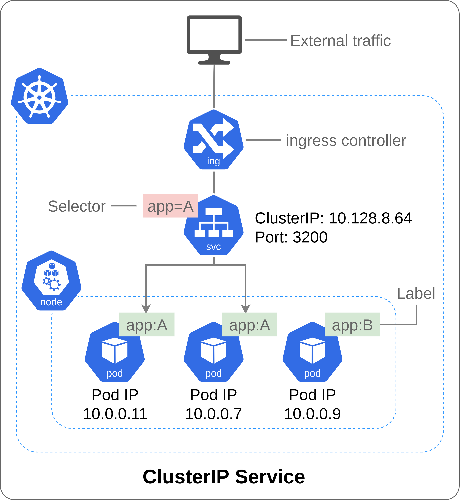
</p>


**NodePort**

- This type of service allows the external traffic to the worker nodes, by using a fixed port on each worker node. 
- It allocates a port from a range 30000–32767.
- NodePort configuration will automatically create the ClusterIP to route the traffic internally. 
- Users can access the service externally by using the IP address of the node and the exposed NodePort. 
- If you are running a service that doesn’t have to be always available, or you are very cost-sensitive, this method will work for you. A good example of such an application is a demo app or something temporary.

<p align="center">
  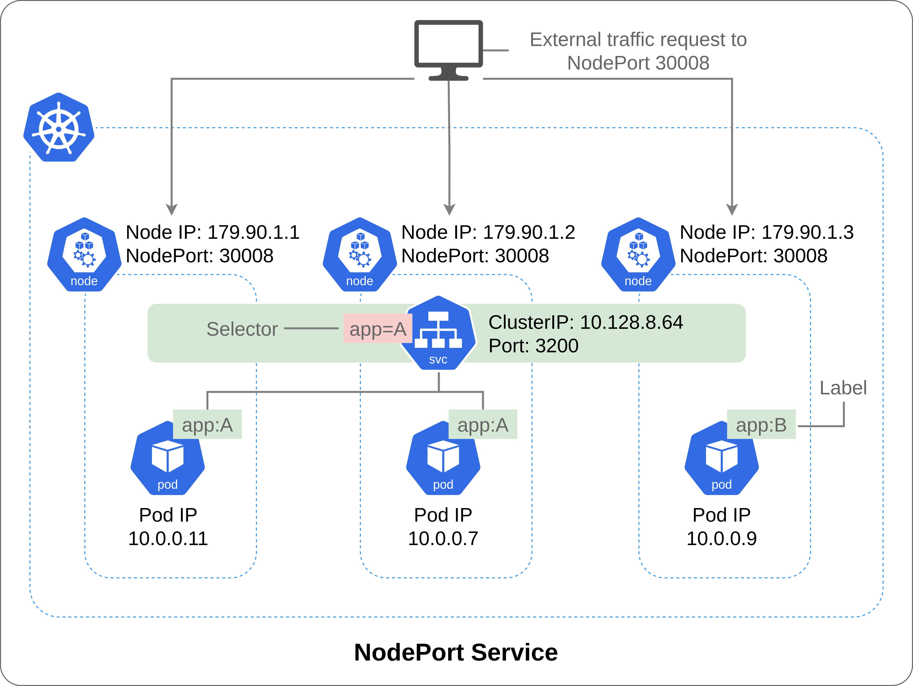
</p>


**LoadBalancer** 
- Used to expose the service externally using a cloud provider’s load balancer. 
- Clients send requests to the IP address of a network load balancer that will forward all traffic to your service.
- If you want to directly expose a service, this is the default method.
- The big downside is that each service you expose with a LoadBalancer will get its own IP address, and you have to pay for a LoadBalancer per exposed service, which can get expensive!

<p align="center">
  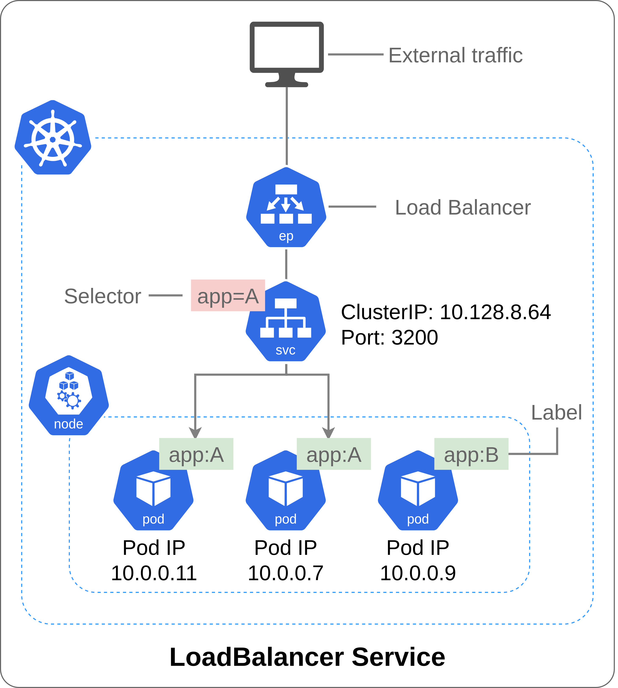
</p>

**Headless**

As we said earlier, each connection to the service is forwarded to one randomly selected backing pod. But, what happens if you want to talk with a group of Pods? or what happens if you want to talk directly with a specific pod?  Connecting through the service isn’t the way to do this. 

  The solution here is to use a **Headless service**. For headless Services, a cluster IP is not allocated, kube-proxy does not handle these Services, and there is no load balancing or proxying done by the platform for them. Instead, Headless allows you to discover pod IPs through DNS lookups.

  Usually, when you perform a DNS lookup for a service, the DNS server returns a single IP — the service’s clusterIP. But if you tell Kubernetes you don’t need a cluster IP for your service (you do this by setting the clusterIP field to `None` in the service specification ), the DNS server will return multiple `A` records for the service, each pointing to the IP of an individual pod backing the service at that moment. 

  In these links you'll find two useful videos about services, types of services, and networking:
    - [Kubernetes Services explained | ClusterIP vs NodePort vs LoadBalancer vs Headless Service](https://www.youtube.com/watch?v=T4Z7visMM4E&ab_channel=TechWorldwithNana)
    - [Pods and Containers - Kubernetes Networking | Container Communication inside the Pod](https://www.youtube.com/watch?v=5cNrTU6o3Fw&ab_channel=TechWorldwithNana)
    - [Kubernetes Services simply visually explained](https://medium.com/swlh/kubernetes-services-simply-visually-explained-2d84e58d70e5)


### 3.3.3 - Ingress

**[Return to topics list](#table-of-contents)**

**[Check icons reference](#icons-reference)**

- Individually exposing and managing services is inefficient and not scalable in large Kubernetes clusters.
- That's how **ingress** becomes the ideal solution.
- Ingress is an API object that provides routing rules to manage access to the services within a k8s cluster.
- **It acts as the entry point for the whole k8s cluster**, exposing multiple services under a single IP address, with a secure protocol and a domain name. 
- External request goes first to ingress and it does the forwarding then to the service.
- Some use cases of Kubernetes Ingress include:
  - Providing externally reachable URLs for services
  - Load balancing traffic
  - Offering name-based virtual hosting
  - Terminating SSL (secure sockets layer) or TLS (transport layer security)

Learn more about ingress in this tutorial:
  - [Kubernetes Ingress Tutorial for Beginners | simply explained | Kubernetes Tutorial 22](https://www.youtube.com/watch?v=80Ew_fsV4rM&t=128s&ab_channel=TechWorldwithNana)

<p align="center">
  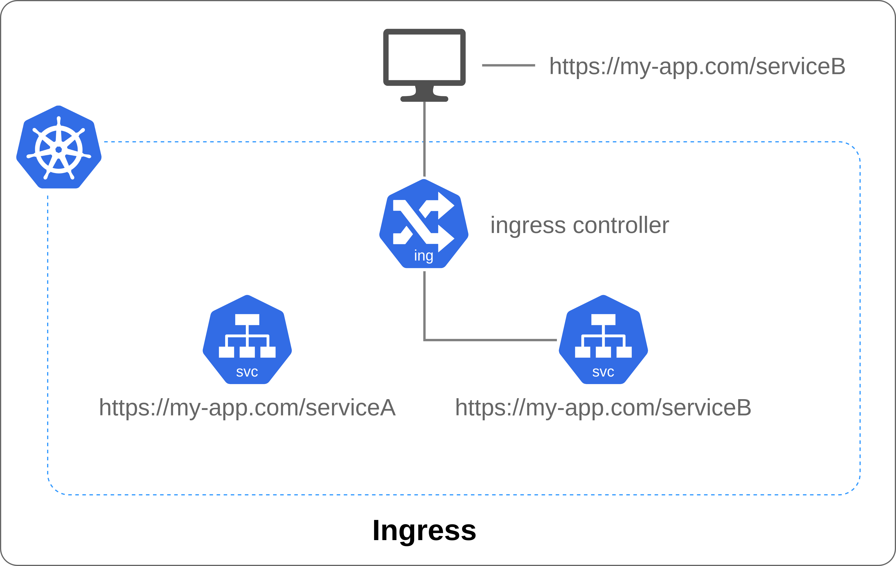
</p>

### 3.3.4 - ReplicaSets
**[Return to topics list](#table-of-contents)**

- In simple words, the [replicaSet](https://kubernetes.io/docs/concepts/workloads/controllers/replicaset/) manages the replicas of a pod.
- You define the replicaSet specifications in a `.yml` manifest file with fields.
- One of the fields is a **selector** that specifies how to identify Pods it can acquire.
- Another field is the number of replicas, indicating how many Pods it should be maintaining.
- Finally, you have a field where you define a pod template specifying the data of new Pods it should create to meet the number of replicas criteria.
- In the example below, ReplicaSet has 3 replicas. If for some reason pod-1,pod-2, or pod-3 dies, the replicaSet will make sure to initialize a new pod to maintain the correct and required number of replicas. Whereas if pod-4 were terminated, it would be gone forever.

```yml
# example YAML file to create a ReplicaSet object.
apiVersion: apps/v1 
kind: ReplicaSet # this field represents the type of Kubernetes object to be created.
metadata: # This is metadata about the object, such as its name, type, api version, annotations, and labels
  name: frontend
  labels:
    app: guestbook
    tier: frontend
spec: # spec means specification. Atributes of spec are specific to the kind!
  replicas: 3 # modify replicas according to your case
  selector:
    matchLabels:
      tier: frontend
  template: 
    # here start another configuration file. These lines below applies to a pod.
    metadata: # metadata about the pod
      labels:
        tier: frontend
    spec: # specifications about the pod
      containers:
      - name: php-redis
        image: gcr.io/google_samples/gb-frontend:v3
```

### 3.3.5 - Deployments
**[Return to topics list](#table-of-contents)**

- As you know, creating applications will always evolve some updates or changes.

- When we deploy a version of our application, we need a mechanism to update the containerized applications automatically, as doing this manually is an overwhelming process, particularly if you have tens, or many hundreds, of services. 

- The [Deployment](https://kubernetes.io/docs/concepts/workloads/controllers/deployment/) is a higher object in the hierarchy, that encapsulates replicaSets and pods. 

- It [Deployment controller](https://kubernetes.io/docs/concepts/architecture/controller/) gives it the ability to monitor, manage and maintain the desired state of the application we want to deploy.

```yml
# example YAML file to create a Deployment object.
apiVersion: apps/v1
kind: Deployment
metadata:
  name: nginx-deployment
  labels:
    app: nginx
spec:
  replicas: 3
  selector:
    matchLabels:
      app: nginx
  template:
    metadata:
      labels:
        app: nginx
    spec:
      containers:
      - name: nginx
        image: nginx:1.14.2
        ports:
        - containerPort: 80
```
### 3.3.6 - Namespaces
**[Return to topics list](#table-of-contents)**

- [Namespaces](https://kubernetes.io/docs/concepts/overview/working-with-objects/namespaces/) are a way to organize clusters into virtual sub-clusters.

- They can be helpful to organise resources when different teams or projects share a Kubernetes cluster.

More about Namespaces in this video:
- [Kubernetes Namespaces Explained in 15 mins | Kubernetes Tutorial 21](https://www.youtube.com/watch?v=K3jNo4z5Jx8&ab_channel=TechWorldwithNana)

### 3.3.7 - ConfigMap and secret

- As we said pods communicate with each other using a service 
- Suppose an application with a database endpoint called `mongo-db-service` 
- For example, if you want to update the endpoint of the service from  `mongo-db-service` to `mongo-db` you would do it inside of the built image of the application. 
- So you'd have to rebuild the application with a new version and you have to push it to the repository (e.g Docker registry) and, then pull that new image in your pod and restart the whole thing. 

<p align="center">
  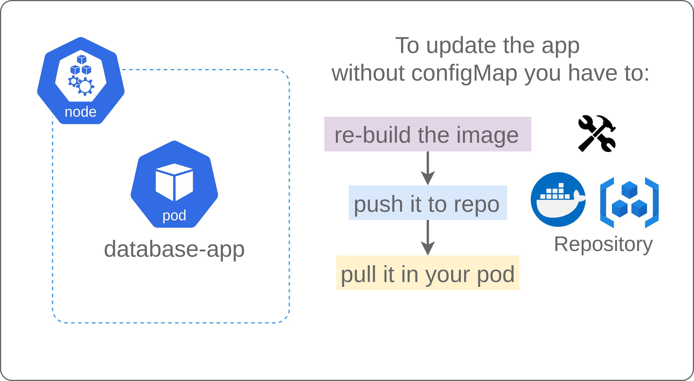
</p>

- It's a little bit tedious for a small change like updating the service name.
- For that purpose, Kubernetes has an object called ```configMap```
- It's an API object to store non-confidential data in key-value pairs.
- It acts as an external configuration to your application, so **Pods can consume configMaps as environment variables, command-line arguments, or as configuration files in volumes**.
- ConfigMap would usually contain configuration data like URLs of a database, database user, etc.
- You just connect it to the pod so that pod gets the data that configMap contains and now if you change for example the endpoint of the service you just adjust the config map and that's it.


<p align="center">
  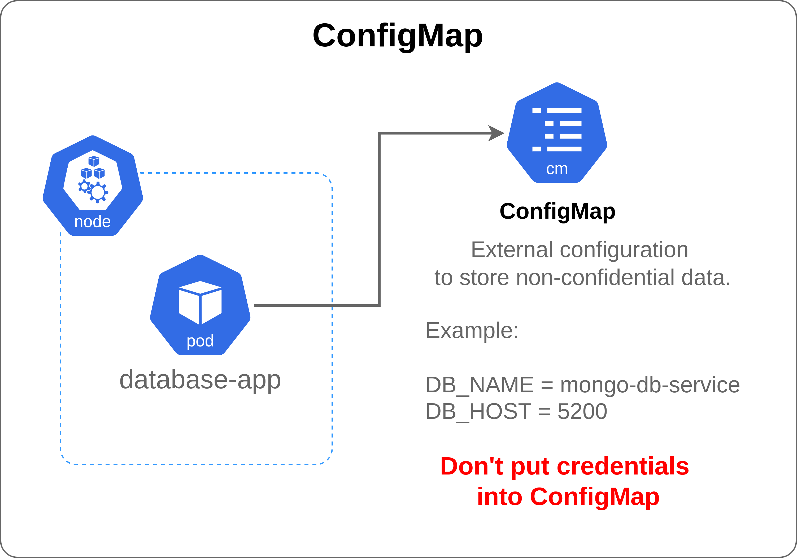
</p>


- Part of the external configuration can also be database username and password.
- Putting a password or other credentials in a configMap in a plain text format would be insecure. 
- For this purpose, Kubernetes has another component called ```secret```.
- Secret is just like configMap but the difference is that it's used to store secret data credentials. 
- Data is stored not in a plain text format, it is in base 64 encoded format.
- Like configMap you just add it to your pod so that pod can see those data and read from the secret. 

<p align="center">
  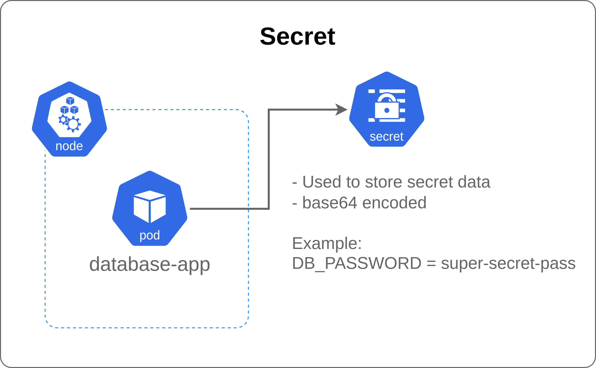
</p>


### 3.4 - Master Nodes (control plane)
**[Return to topics list](#table-of-contents)**

**[Check icons reference](#icons-reference)**

The Control Plane or (Master Node) controls your K8s cluster, and it consists of multiple components that are responsible of managing that cluster.

The main components of a k8s master node are kube-apiserver, kube-scheduler, kube-controller-manager, etcd and cloud-controller-manager.

<p align="center">
  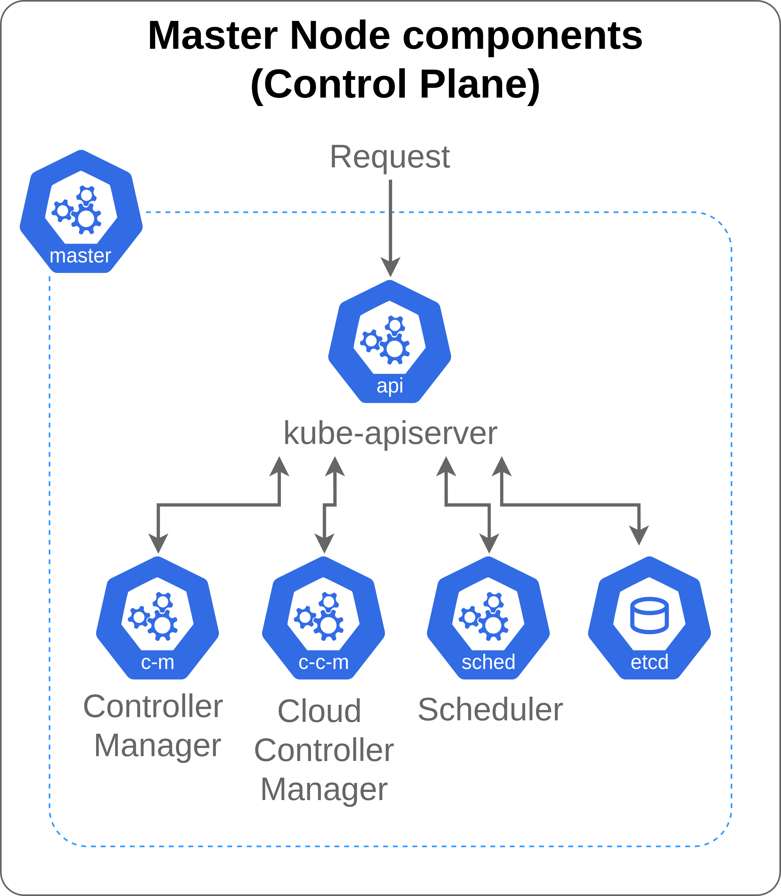
</p>

### 3.4.1 - kube-apiserver

**[Return to topics list](#table-of-contents)**

**[Check icons reference](#icons-reference)**

- kube-apiserver is the primary interface to interact with your k8s cluster. 
- The kube-apiserver is like a cluster gateway that gets the initial request to the cluster. 
- To interact with the kube-apiserver you can use some client, like the UI Kubernetes dashboard, the command line (e.g `kubectl`), or a Kubernetes API. 
- It also acts as a gatekeeper for authentication to make sure that only authenticated and authorized requests can get through the cluster. 
- So whenever you want to schedule new pods, deploy new applications, create new service, or any other components you have to talk to the kube-apiserver on the master node and the kube-apiserver then validates your request, and if everything is fine then it will forward your request to other processes.

<p align="center">
  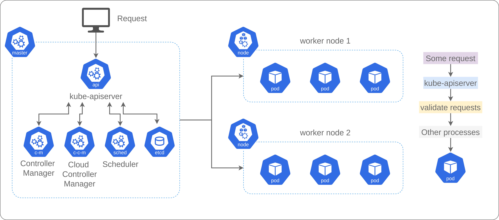
</p>

### 3.4.2 - kube-scheduler

**[Return to topics list](#table-of-contents)**

**[Check icons reference](#icons-reference)**

- Suppose you send a request to the kube-apiserver to start or schedule a new component (let's say a pod).
- After the request is validated, it will be sent to the kube-scheduler, which has a logic to decide on which specific worker node the pod should be scheduled.
- First, it will look at your request and see how many resources the pod will need, how much CPU, how much ram, etc.
- Then it's going to go through the worker nodes and see the available resources on each one of them and if it sees that one node is the least busy or has the most resources available it will schedule the new pod on that node. 
- An important point here is that scheduler just decides on which node a new pod will be scheduled, but the process that actually starts that pod is **kubelet**. 

<p align="center">
  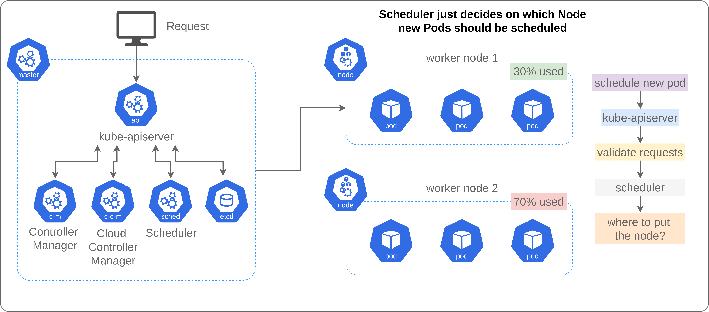
</p>


### 3.4.3 - kube-controller-manager

**[Return to topics list](#table-of-contents)**

**[Check icons reference](#icons-reference)**

- What happens when a pod or any component dies on a node? There must be a way to detect that and then reschedule those components as soon as possible.
- Here comes the controller manager in action. It contains multiple logical controllers to track and handle the state of K8s objects.
- For example, when a pod dies, the controller manager detects that and tries to recover the cluster state as soon as possible and for that, it makes a request to the scheduler to reschedule those dead pods.
- Then the scheduler decides based on the resource calculation which worker nodes should restart those pods again and makes requests to the corresponding kubelet process on those worker nodes to actually restart the pods.

<p align="center">
  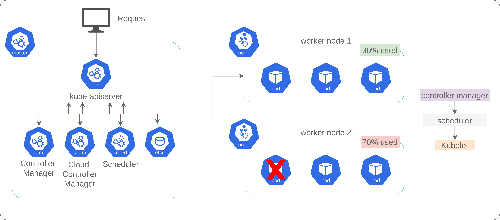
</p>

### 3.4.4 - etcd

**[Return to topics list](#table-of-contents)**

**[Check icons reference](#icons-reference)**

- It's a key-value store that K8s uses as its data store for the cluster state. 
- You can think of it as a cluster brain, because every change in the cluster will be saved or updated into this key-value store of etcd, and all of the seen mechanism (the scheduler, the controller manager, etc) works because of its data.
- For example, how does the scheduler know what resources are available on each worker node? or how does the controller manager know that a cluster state changed in some way? All of this information is stored in etcd cluster.
- What is not stored in the etcd key-value store is the actual application data for example if you have a database application running inside of the cluster, the data will be stored somewhere else not in the etcd. 
- etcd is just a cluster state information that is used for master processes to communicate with their work processes and vice versa.
- You can see that **master nodes are crucial for the cluster operation**, especially the etcd store which contains some data that must be reliably stored or replicated. 
- So in practice, a Kubernetes cluster is usually made up of multiple masters where each master node runs its master processes, where the kube-apiserver is load balanced and the etcd store forms a distributed storage across all the master nodes.

<p align="center">
  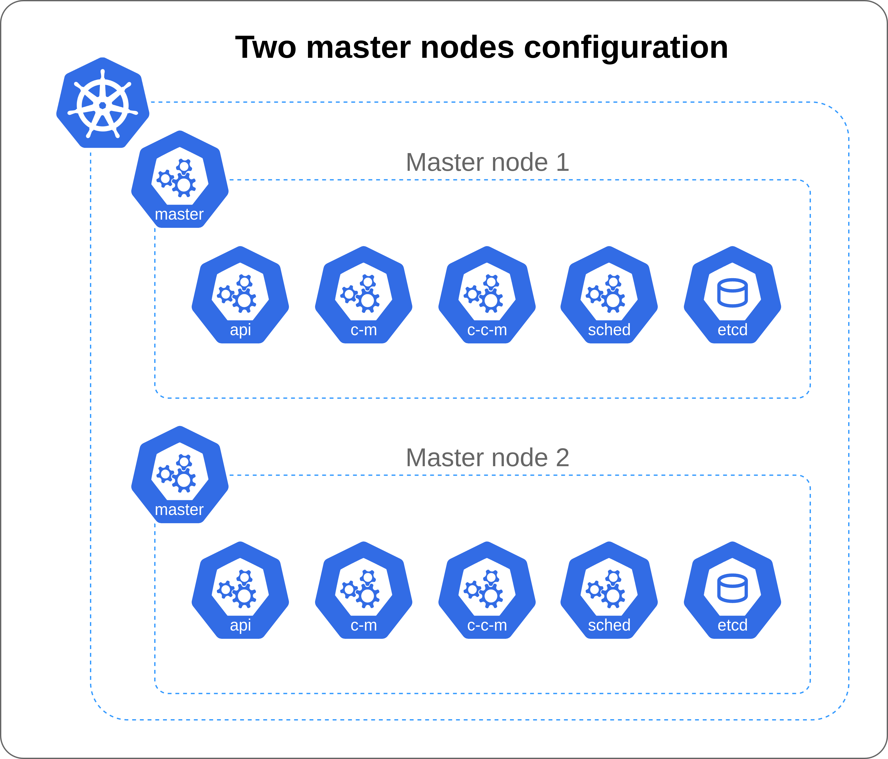
</p>


### 3.4.5 - cloud-controller-manager

**[Return to topics list](#table-of-contents)**

- Provides an interface between K8s and different cloud platforms. It’s only used when using cloud-based resources alongside K8s.


### 4 - Volumes

**[Return to topics list](#table-of-contents)**

**[Check icons reference](#icons-reference)**

- Suppose we have a database service in our application, where we save some data.
- If the database container or the pod gets restarted the data would be gone.
- That's problematic and inconvenient because you want your database data to be persisted reliably long term.
- The way to do this is with another component of Kubernetes called ```volumes```
- It basically attaches a physical storage to your pod and **that storage could be either on a local machine** (meaning on the same server node where the pod is running) or it could be on a **remote storage outside of the Kubernetes cluster**, like cloud storage or some on-premise storage. 
- You just have an external reference on it. 
- So now when the database pod or container gets restarted all the data will be there persisted.
- It's important to understand that a ```Kubernetes cluster doesn't manage any data persistence```, which means that you are responsible for backing up the data replicating and managing it, and making sure that it's kept on proper hardware.


<p align="center">
  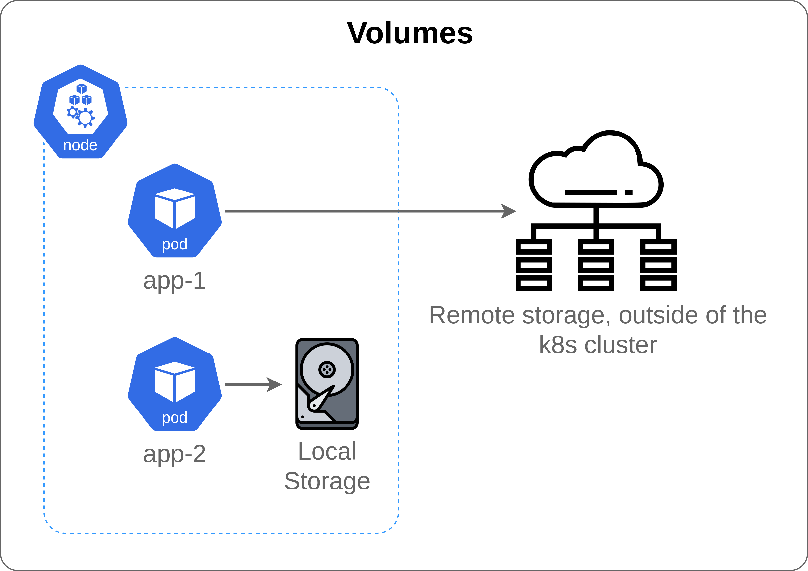
</p>

## 5 - Kubectl - The CLI
**[Return to topics list](#table-of-contents)**

- There are 3 main tools to interact with a k8s cluster.
- You can have a UI like a dashboard, the Kubernetes API, or a command-line tool like `kubectl`.
- [Kubectl](https://kubernetes.io/docs/tasks/tools/#kubectl) is a command-line tool for a Kubernetes cluster. 
- It's the most powerful of all the three clients because with kubectl you can basically do anything in the Kubernetes cluster.
- An important thing to note here is that kubectl isn't just for local clusters. If you have a cloud cluster or a hybrid cluster, kubectl is the tool to use to interact with them.

Here, we’ll cover some of the most frequently used commands you’ll need:

```bash
# kubectl get: lists objects within the Kubernetes cluster.
$ kubectl get <object type> <object name> -o <output> --sort-by <JSONPath> --selector <selector>

# kubectl describe: get detailed information about a given object.
$ kubectl describe <object type> <object name>

# kubectl create: to create objects by providing a YAML file, with -f to create an object from a YAML descriptor stored in the file.
$ kubectl create -f <file name>

# kubectl apply: same as create, but will update the object if it exists. It also stores the last-applied-configuration annotation.
$ kubectl apply -f <file name>

#kubectl delete: delete objects from the cluster.
$ kubectl delete <object type> <object name>
```

## 6 - Creating objects: manifest files vs imperative declaration
**[Return to topics list](#table-of-contents)**


- Usually, for creating objects in K8s you can choose between two methods: the declarative one and the imperative one.

- In the declarative method, you have to create a `YAML` file and run `kubectl apply/create/delete -f file.yaml` command to do the job. Here is an example of YAML file:

```yaml
apiVersion: v1 # version of the k8s object, depend on the project (v1, apps,v1, etc). run kubectl api-versions to see a complete a list.
kind: Pod  # type of Kubernetes object to be created (Pod, Deployment, ReplicaSet, etc)
metadata: # This is metadata about the object, such as its name, type, api version, annotations, and labels
 name: nginx 
 namespace: dev-ns
labels: 
  type : backend 
spec : # spec means specification. Atributes of spec are specific to the kind!
  # here start another configuration file. These lines below applies to a pod.
  containers: 
    - image: nginx
      name: nginx-pod
    dnsPolicy: ClusterFirst
    restartPolicy: Always
```

More about kubernetes manifest files in these links:

  - [Understanding the Kubernetes manifest](https://medium.com/@sujithabdulrahim/understanding-the-kubernetes-manifest-e96d680f2a11)
  - [Kubernetes YAML File Explained - Deployment and Service | Kubernetes Tutorial 19](https://www.youtube.com/watch?v=qmDzcu5uY1I&t=312s&ab_channel=TechWorldwithNana)

- In the imperative method, you can run kubectl commands to interact with the cluster. This is useful if you need to quickly spinning things up using kubectl directly to experiment. 

Here an example:

```
$ kubectl run nginx --image=nginx
pod/nginx created

$ kubectl get pods 
NAME    READY   STATUS    RESTARTS   AGE
nginx   1/1     Running   0          58s
```

# Hands-on exercises

**[Return to topics list](#table-of-contents)**

- **[1. Local setup and first k8s cluster](./exercises/exercise-1.md)**
- **[2. Deploying postgres and adminer in a k8s cluster](./exercises/exercise-2.md)**


# Credits and Acknowledgements

The main sources for the above information are:

- [Kubernetes official documentation](https://kubernetes.io/)
- [Kubernetes Icons Set](https://github.com/kubernetes/community/tree/master/icons)
- [Kubernetes Patterns - Reusable Elements for Designing Cloud-Native Applications](https://www.redhat.com/cms/managed-files/cm-oreilly-kubernetes-patterns-ebook-f19824-201910-en.pdf)
- [Kubernetes — What Is It, What Problems Does It Solve and How Does It Compare With Alternatives?](https://eng.zemosolabs.com/kubernetes-what-is-it-what-problems-does-it-solve-how-does-it-compare-with-its-alternatives-937fe80b754f)
- [Kubernetes Tutorial for Beginners [FULL COURSE in 4 Hours]](https://www.youtube.com/watch?v=X48VuDVv0do&ab_channel=TechWorldwithNana)
- [KUBERNETES De NOVATO a PRO! (CURSO COMPLETO EN ESPAÑOL)](https://www.youtube.com/watch?v=DCoBcpOA7W4&t=4164s&ab_channel=PeladoNerd)
- [Understanding the Kubernetes manifest](https://medium.com/@sujithabdulrahim/understanding-the-kubernetes-manifest-e96d680f2a11)
- [Kubernetes Objects](https://chkrishna.medium.com/kubernetes-objects-e0a8b93b5cdc)
- [HOW DO APPLICATIONS RUN ON KUBERNETES?](https://thenewstack.io/how-do-applications-run-on-kubernetes/)
- [Exposing Applications for Internal Access](https://kubebyexample.com/en/learning-paths/application-development-kubernetes/lesson-3-networking-kubernetes/exposing#)
- [Getting Started with K8s: Core Concepts](https://edgehog.blog/getting-started-with-k8s-core-concepts-135fb570462e)
- [What is a headless service, what does it do/accomplish, and what are some legitimate use cases for it?](https://stackoverflow.com/questions/52707840/what-is-a-headless-service-what-does-it-do-accomplish-and-what-are-some-legiti)
- [https://github.com/jgraph/drawio-libs](https://github.com/jgraph/drawio-libs)
- [Kubernetes NodePort vs LoadBalancer vs Ingress? When should I use what?](https://medium.com/google-cloud/kubernetes-nodeport-vs-loadbalancer-vs-ingress-when-should-i-use-what-922f010849e0)
- [Connecting Kube cluster through proxy and clusterIP?](https://stackoverflow.com/questions/58269082/connecting-kube-cluster-through-proxy-and-clusterip)