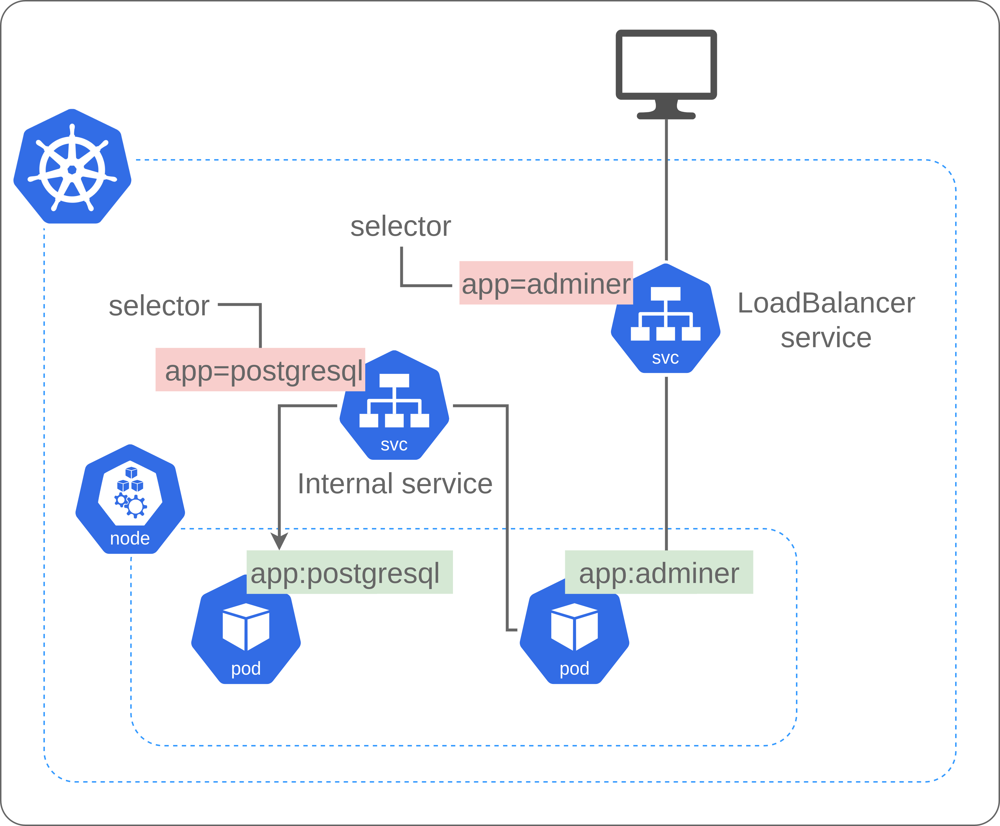

## Exercise 2 - Deploying postgres and adminer in a k8s cluster

**[Return to k8s topics list](/README.md)**

**[Proposed solution](./solutions/solution-exercise-2/solution-exercise-2.md)**

In this exercise you have to deploy two applications in a k8s cluster:

- Adminer: a user-interface tool for managing content in databases (create, alter, drop, delete, import, and export MySQL tables). It natively supports MySQL, MariaDB, PostgreSQL, SQLite, MS SQL, Oracle, Elasticsearch, and MongoDB. 
- Postgresql: a free and open-source relational database management system.

The k8s cluster architecture should have:

- 1 postgresql pod
- 1 adminer pod
- 1 internal service to talk to the postgresql pod (external requests are not allowed!)
- 1 variable called `postgres-db` in a `configMap`. This will be the default database to be created.
- 1 `secret` file to store Authentication variables. For example `postgresql-username` and `postgresql-password`.
- The `configMap` and the `secret` must be referenced in a `Deployment` YAML file.
- You must create 1 Deployment for postgresql and 1 Deployment for Adminer.
- In these `Deployment` files you should specify the attributes to create the pods and services.
- Finally, adminer should be accessible through the browser, so you have to create a service reachable from the internet using `LoadBalancer service`.

This is an idea of what you have to build:

  

