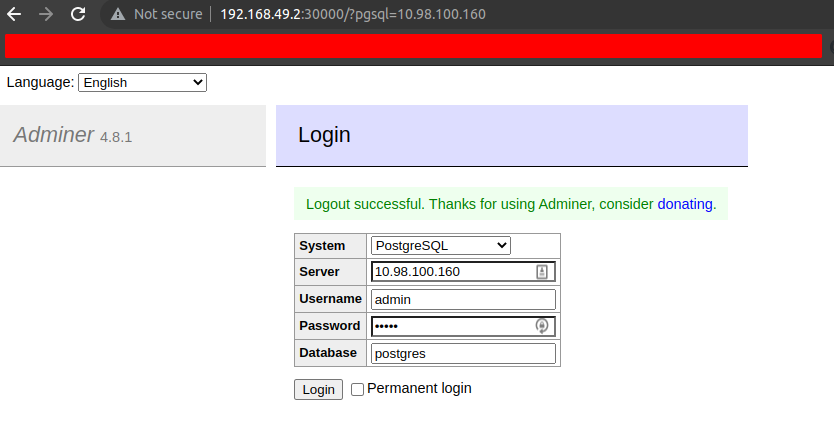

# Solution - Exercise 2

**[Return to k8s topics list](/docs/kubernetes/kubernetes.md)**

First, let's create a cluster with 1 master node and 1 worker node using minikube:

```
minikube start -p postgresql-adminer-cluster
```

Now we have to create the `configMap` and the `secret` to reference them into the `Deployments` files.

```yml
# secret 
apiVersion: v1
kind: Secret
metadata:
    name: postgresql-secret
type: Opaque # default for arbitrary key-value pairs

# here below yo define the actual contents in key-value pairs
# the values cannot be plain text. They must be base64 encoding
# You can create a base64 encoding pretty simple
# open a terminal and run: `echo -n 'some-secret-value' | base64`
data:
    postgresql-username: YWRtaW4=
    postgresql-password: YWRtaW4=
```

```yml
# configMap 
apiVersion: v1
kind: ConfigMap
metadata:
  name: postgresql-configmap
data:
  postgres-db: postgres
```

The run this command to create the configMap and the secret:

```
kubectl apply -f postgresql-secret.yml
```

```
kubectl apply -f postgresql-configMap.yml
```

You can test if those objects were created by running:

```
kubectl get secret
...
kubectl get configMap
```

Now it's time to create the Deployment for both, postgresql and adminer:


```bash
# this yaml file also contains the information about the internal service
kubectl apply -f postgresql-deployment.yml
```

```bash
# this yaml file also contains the information about the LoadBalancer service
kubectl apply -f adminer-deployment.yml
```

Now let's check the services and the pods:

```bash
kubectl get pod -o wide

# output
NAME                                    READY   STATUS              RESTARTS   AGE   IP       NODE                         NOMINATED NODE   READINESS GATES
adminer-deployment-5689959bd-fz9nx      0/1     ContainerCreating   0          21s   <none>   postgresql-adminer-cluster   
postgresql-deployment-5d547bb6f-cs9kw   0/1     ContainerCreating   0          26s   <none>   postgresql-adminer-cluster   

# after a few minutes you'll get this
NAME                                    READY   STATUS    RESTARTS   AGE   IP           NODE                         NOMINATED NODE   READINESS GATES
adminer-deployment-5689959bd-fz9nx      1/1     Running   0          55s   172.17.0.4   postgresql-adminer-cluster   
postgresql-deployment-5d547bb6f-cs9kw   1/1     Running   0          60s   172.17.0.3   postgresql-adminer-cluster   
```

```bash
kubectl get service

# output
NAME                 TYPE           CLUSTER-IP     EXTERNAL-IP   PORT(S)          AGE
adminer-service      LoadBalancer   10.96.45.185   <pending>     8080:30000/TCP   16s
kubernetes           ClusterIP      10.96.0.1      <none>        443/TCP          16m
postgresql-service   ClusterIP      10.96.216.94   <none>        5432/TCP         22s

kubectl describe service postgresql-service

# Name:              postgresql-service
Name:              postgresql-service
Namespace:         default
Labels:            <none>
Annotations:       <none>
Selector:          app=postgresql
Type:              ClusterIP
IP Family Policy:  SingleStack
IP Families:       IPv4
IP:                10.98.100.160
IPs:               10.98.100.160
Port:              <unset>  5432/TCP
TargetPort:        5432/TCP
Endpoints:         172.17.0.3:5432
Session Affinity:  None
Events:            <none>
```

Now if you compare the ip addres of the `postgresql-deployment-6fbb895f47-4zpt9` and the `Endpoints` item of the internal service postgresql-service the should be the same:

- Pod ip: `172.17.0.3`
- Internal service endpoint item: `172.17.0.3:5432`


Finally we need access to Adminer from our browser. 
To do this just execute this command to assign an external ip adress to your service:

```bash
minikube service adminer-service -p postgresql-adminer-cluster --url

# output
http://192.168.49.2:30000
```

And you'll get something like this:


<p align="center">
  
</p>

In the server field you have to put the ip address of postgresql-service service.

```bash
kubectl get services

NAME                 TYPE           CLUSTER-IP       EXTERNAL-IP   PORT(S)          AGE
adminer-service      LoadBalancer   10.100.128.124   <pending>     8080:30000/TCP   29m
kubernetes           ClusterIP      10.96.0.1        <none>        443/TCP          30m
postgresql-service   ClusterIP      10.98.100.160    <none>        5432/TCP         29m

# use 10.98.100.160 as `server` in Adminer
```

You can monitor your cluster running:

```
minikube dashboard -p postgresql-adminer-cluster
```